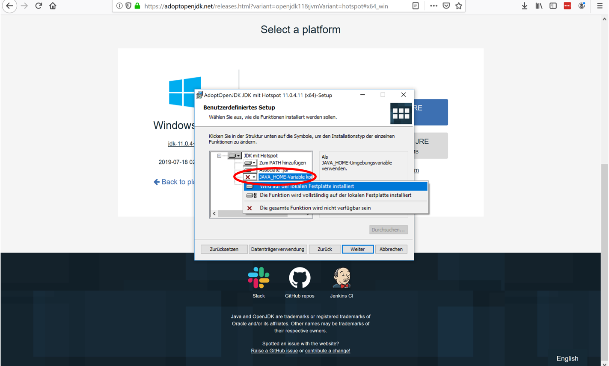
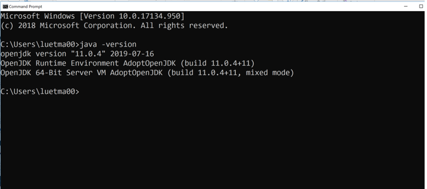

# Installation des Java Development Kits

Um Java Programme kompilieren und ausführen zu können, müssen Sie auf Ihrem Computer das Java Development Kit (JDK) installieren. 
Es gibt verschiedene Versionen des JDKs, die zum Teil auch von unterschiedlichen Organisationen angeboten und gepflegt werden.
Grundsätzlich sollten Sie die in diesem Kurs entwickelten Programme mit jedem JDK ab Version 8 kompilieren und ausführen können. 
Wir empfehlen Ihnen jedoch, die Version 11 vom OpenJDK zu verwenden.

## Anleitung

Im folgenden führen wir Sie durch die wichtigsten Schritte die Sie durchführen müssen um das JDK auf Ihrem Computer zu installieren. Wir illustrieren dies hier nur für Windows. Wenn Sie ein anderes Betriebssystem (wie MacOS oder Linux) verwenden, führen Sie die Schritte sinngemäss für Ihr Beriebssystem aus. Sollten Probleme auftauchen, finden Sie viele Informationen im Internet. Sie können sich auch an die Tutorinnen und Tutoren wenden. 

#### Download

Nachdem Sie auf die Seite [AdoptOpenJDK](https://adoptopenjdk.net/?variant=openjdk11&jvmVariant=hotspot){:target="_blank"} gelangt sind, sollte die Version (OpenJDK 11) und der JVM Typ (Hotspot) schon ausgewählt sein, ansonsten sollten Sie diese Auswahl manuell treffen.


Die blaue Schaltfläche (Latest release / Neueste Veröffentlichung / Dernière Version) lädt den Installer für Ihr aktuelles Betriebssystem herunter.

Nachdem Sie den Installer heruntergeladen haben, führen Sie diesen aus und folgen Sie den einzelnen Schritten. 

**Im Schritt *Benutzerdefiniertes Setup* wählen Sie aus, dass die Variable *JAVA_HOME* gesetzt wird:**



Nachdem Sie das JDK installiert haben, öffnen Sie eine Konsole (durch Drücken der Windows Taste und Eingabe von ```cmd```). Geben Sie dann folgendes ein um zu sehen, ob Java erfolgreich installiert wurde:

```
java -version
```

Falls die Installation funktioniert hat, sollten Sie folgende Meldung sehen:
