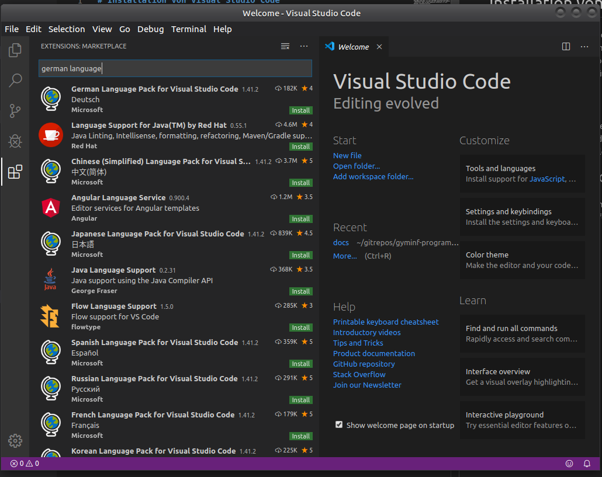
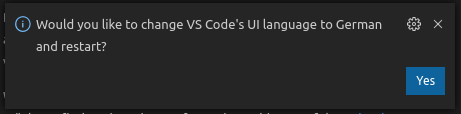

# Installation von Visual Studio Code

Visual Studio Code (VS Code oder auch einfach Code genannt) ist ein auf den ersten Blick einfacher aber durchaus sehr mächtiger Code Editor für alle gängigen Betriebssysteme und Programmiersprachen. Von Haus aus wird JavaScript (mit NodeJS) unterstützt, aber es gibt sogenannte Extensions für alle gängigen Programmiersprachen.

## Download
Laden Sie bitte den entsprechenden Installer für Ihr System von der [VSCode Download Website](https://code.visualstudio.com/Download){:target="_blank"} und installieren Sie VSCode entsprechend der Installationsanleitung oder folgen Sie den Anweisung des Installers.

## Die Sprache von VS Code ändern
Visual Studio Code enthält von Haus aus nur Unterstützung für Englisch, um den Editor auf Deutsch nutzen zu können, befolgen Sie bitte folgende Schritte:

1. Öffnen Sie bitte das "Extension Fenster" durch drücken von Ctrl-Shift-X oder durch drücken des entsprechenden Knopf, links in der Menübar.

2. Tippen Sie in das nun sichtbare Such-Feld: "german language". 

3. Dannach sollte als erster Eintrag in den Suchresultaten das "German Language Pack for VS Code" stehen, drücken Sie den grün hinterlegten "Install" Button.

4. Sobald die Extension (Das Sprachpacket) installiert wurde, erscheint unten rechts im Editor die Frage ob Sie die "UI language" auf Deutsch stellen möchten: Drücken Sie "Yes".

5. Dannach werden Sie aufgefordert, den Editor neu zu starten. Dieser sollte nach dem Neustart in Ihrer gewünschten Sprache erscheinen.