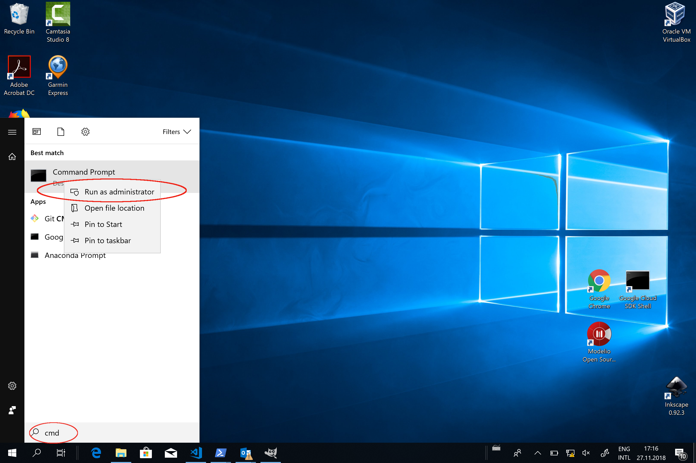

# Installation von Jupyter-Notebooks für Java

Jupyter-Notebooks sind eine Webanwendung, die es ermöglicht Programme in einem Webbrowser zu schreiben, zu kommentieren und auszuführen. 
 Jupyter Notebooks wurden ursprünglich für Python geschrieben, sind aber inzwischen auch für andere Programmiersprachen verfügbar. Seit kurzen besteht auch die Möglichkeit, Jupyter Notebooks mit Java zur nutzen. 
 Da das dafür benötigte [ijava](https://github.com/SpencerPark/IJava) Programm noch nicht im Standardumfang von Jupyter Notebooks enthalten ist, ist die Installation noch etwas aufwändig. 
 Wir stellen Ihnen deshalb ein [Virtualbox](www.virtualbox.org) image sowie einen [Docker](https://www.docker.com/) Container mit der bereits fertig aufgesetzten Umgebung zur Verfügung.  Diese Anleitung beschreibt wie Sie diese Umgebung mittels Virtualbox und Docker installieren und nutzen können. 

## Virtualbox oder Docker

Sie haben zwei verschiedene Möglichkeiten die Jupyter Notebooks zu installieren:

* Sie nutzen Oracle Virtualbox und lassen darauf eine virtuelle Maschine laufen, welche wir für Sie fertig aufgesetzt haben.
* Sie nutzen Docker und den von uns vorbereiteten Docker Container.

Die erste Variante ist etwas einfacher und kann komplett via einer graphischen Oberfläche durchgeführt werden. Dies ist die empfohlene Variante für alle, die sich möglichst wenig mit technischen Details auseinandersetzen möchen oder gar nicht mit der Kommandozeile vertraut sind. Auch empfehlen wir diese Variante wenn Sie *Windows 10 Home* als ihr Betriebsystem nutzen. 
Der Hauptnachteil davon ist, dass Sie etwas Festplattenspeicher verschwenden (die Virtuelle Maschine ist ca 5 GB gross) und die Ausführung ist eventuell etwas langsamer als bei der Verwendung von Docker.

Die zweite Variante, die Nutzung von Docker, ist deutlich schlanker. Wir empfehlen diese Variante für alle die Wert auf ein schlankes System legen, versiert mit der Kommandozeile sind, oder sich schon immer mal diese populäre Technologie anschauen wollten. Docker kann man unter allen gängigen Betriebssystemen (Windows, Linux, MacOS) installieren. Am einfachsten ist die Installation aber unter Linux, da Docker ursprünglich für Linux entwickelt wurde.

*Je nach Computertyp müssen Sie im BIOS des Computers die Virtualisierungsunterstützung (VT-X) aktivieren. Das Installationsprogramm wird Ihnen das ensprechend anzeigen. Dieser Schritt ist zum Beispiel [hier](https://www.tactig.com/enable-intel-vt-x-amd-virtualization-pc-vmware-virtualbox/) gut beschrieben. Falls Sie sich in diesem oder einem anderen Installationsschritt unsicher fühlen sollten, können Sie in einer Übungsstunde von den TutorInnen helfen lassen.*

*Falls bei Ihnen keine dieser zwei Varianten funktionieren sollte, haben wie eine Notfalllösung vorbereitet. Sie finden Informationen dazu unter Punkt 3* 


## 1. Installation mittels Virtualbox


1. Gehen Sie auf die [Downloadseite](https://www.virtualbox.org/wiki/Downloads) von Oracle Virtualbox 
2. Wählen Sie unter *VirtualBox 6.0.12 platform packages* das Ihrem Betriebssystem entsprechende Paket und installieren Sie dieses. 
    * (Falls nötig finden Sie weitere Details und Screenshots zur Installation von Virtualbox in dieser [Anleitung](https://www.wikihow.com/Install-VirtualBox))
3. Laden Sie die Virtuelle Maschine mit den Jupyter-Notebooks von [hier](https://drive.switch.ch/index.php/s/sOI4gedaJ9cue1v) herunter. 
4. Starten Sie nun Virtualbox. Sie sollten folgendes Fenster sehen 
5. Importieren Sie die in Schritt 3 heruntergeladene Datei indem Sie ```Datei->Appliance importieren``` wählen, und die entsprechende Datei im Dialogfenster auswählen. Drücken Sie ```Weiter``` und wählen Sie ```Importieren``` auf der nächsten Seite. 
6. Starten Sie die Virtuelle Machine indem Sie diese in der Liste auf der linken Seite die soeben importierte Maschine auswählen und den Startbutton drücken.


Herzliche Gratulation! Die Installation ist hiermit abgeschlossen und Sie können mit den Notebooks arbeiten. 


### 1.1 Starten von Jupyter Notebooks
In der von Ihnen gestarteten Virtuellen Maschine finden Sie den Firefox Browser. Starten Sie diesen. In der Toolbar sollten Sie den Button *Jupyter-notebooks* sehen. Dieser bringt Sie direkt zu den Notebooks. 

*Wichtig! Nach langer Inaktivität wird der Screen der Virtuellen Machine gesperrt und sie werden nach dem Passwort gefragt. Der Benutzername für die Virtualbox ist ```jupyter``` und das Passwort ```notebook```.*


## 2. Installation mittels Docker oder Docker Toolbox

Damit Sie den unseren Docker Container nutzen können, müssen Sie zuerst Docker oder Docker toolbox auf Ihrem System installieren. Docker toolbox wählen Sie immer dann, wenn Sie auf einer Windows version arbeiten, die Docker nicht unterstützt (Wie zum Beispiel Windows 10 home) oder Sie bereits Virtualbox unter Windows einsetzen. 

1. Folgend Sie dann der Installationsanleitung für Ihr System:
    * Anleitung für [Windows (Docker)](https://docs.docker.com/docker-for-windows/install/)
    * Anleitung für [Windows (Docker toolbox)](https://docs.docker.com/toolbox/toolbox_install_windows/)
    * Anleitung für [MacOS](https://docs.docker.com/docker-for-mac/install/)
    * Anleitung für Linux: [Ubuntu](https://docs.docker.com/install/linux/docker-ce/ubuntu/), [Debian](https://docs.docker.com/install/linux/docker-ce/debian/), [Fedora](https://docs.docker.com/install/linux/docker-ce/fedora/), [CentOS](https://docs.docker.com/install/linux/docker-ce/centos/)


2. Öffnen Sie eine Kommandozeile (Terminal). Sie sollten in dieser Kommandozeile Administrationsrechte haben.
    * Unter Windows können Sie die Kommandozeile als Administrator öffnen indem Sie im Startmenu auf den Kommandozeileneintrag Rechtsklicken und "als Administrator ausführen" auswählen.
    * Unter Linux und Mac können Sie die Kommandozeile als normaler Nutzer ausführen und dann ```sudo su ``` aufrufen um Administrator zu werden.


Geben Sie nun folgenden Befehl ein um den Container mit dem Jupyter Notebook auf ihr System zu bringen.
```
docker pull marcelluethi/programmieren-notebooks:1.3
```

*Falls Sie in diesem Schritt eine Fehlermeldung bekommen, könnte es daran liegen, dass Docker nicht gestartet ist. Unter Windows und MacOS starten Sie Docker, in dem Sie die Docker Anwendung aufrufen (Sie finden diese im Startmenu). Unter Linux sollte dieses Problem nicht auftauchen.*


Bevor Sie die Jupyter Notebooks verwenden können müssen Sie diese noch starten. 
Dazu geben sie folgenden Befehl ein
```
docker run --name jupyter-java -p 8888:8888  -it marcelluethi/programmieren-notebooks:1.3
```

Falls Sie diesen Schritt erfolgreich durchgeführt haben, steht Ihnen nun die Jupyter Notebooks Umgebung auf Ihrem Computer zur Verfügung. 

Starten Sie nun einen Browser und falls Sie Docker (und nicht Docker toolbox verwenden) geben Sie folgende URL ein 
```
http://localhost:8888
```
Falls Sie Docker toolbox verwenden, geben Sie folgende URL ein
```
http://192.168.99.100:8888 
```

Falls Sie folgende Webseite sehen, war die Installation erfolgreich.
 


### Starten des Docker containers nach einem Neustart des Systems

Wenn Sie den Computer neu starten oder im Jupiter Notebook auf den *Quit* Knopf drücken, wird der Docker container gestoppt. Um diesen wieder zu starten, geben Sie folgendes Kommando ein

```
docker start jupyter-java
```


## 3. Jupyter Notebooks in der Cloud

Falls Sie Probleme mit der Installation von Docker haben, die auch von den Tutoren nicht gelöst werden können, können Sie auf eine cloudbasierte Lösung zurückgreifen. Diese Lösung hat die Einschränkung, dass Sie zwar alle Programme ausführen und verändern können, diese aber nicht speichern können. Ausserdem kann das System bei hoher Nutzung langsam werden. *Eine lokale Installation ist deshalb immer die bevorzugte Lösung!*


Gehen Sie zurück auf die Github Seite: [https://github.com/unibas-marcelluethi/programmieren-notebooks](https://github.com/unibas-marcelluethi/programmieren-notebooks).
Drücken Sie dann auf *launch binder* (siehe Bild):

 
