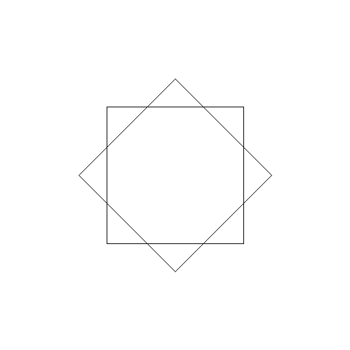


# Übungen 1

Bitte verwenden Sie die Vorlagen im [Zipfile zu den Übungen](https://github.com/unibas-marcelluethi/gyminf-programmieren/raw/master/docs/block1/uebung1.zip).


Sie können diese Aufgaben wie schon besprochen manuell mit _javac_ und _java_ kompilieren und ausführen. Wir stellen Ihnen aber eine Test-Suite zur Verfügung, mit denen Sie Ihre Lösung bis zu einem gewissen grad selbständig überprüfen können. Falls Sie das automatisiert testen möchten, lesen Sie bitte die [Kurzanleitung](kurzanleitung-gradle.md)

## Aufgabe 1 - Berechnung des BMI

Schreiben Sie ein Java-Programm, das den BMI berechnet. Nutzen Sie dazu die bereits vorbereitete Datei _BMI.java_, die Sie im Verzeichnis _uebung1/src/main/java_ finden.

Ihr Programm sollte sich als Parameter die Grösse (in cm) und das Gewicht (in kg) übergeben bekommen. Dabei soll ein Aufruf

```
java BMI 188 88
```

den BMI anhand der Formel

$$\frac{Gewicht[kg]}{Grösse[m]^{2}}$$

berechnen und die folgende Ausgabe berechnen

```
Ihr BMI beträgt: 24.898143956541425
Sie haben einen BMI zwischen 20 und 25.
```

Dabei soll die zweite Zeile jeweils angepasst werden wenn der BMI unter 20 oder über 25 ist. Für unter 20 soll "Sie haben einen BMI unter 20." ausgegeben werden und bei einem BMI über 25 soll "Ihr BMI ist über 25." ausgegeben werden.

:warning: Hinweis: Um Parameter welche Java übergeben werden Variablen vom Typ double zuzuweisen können Sie folgenden Code benützen:

```java
double a = Double.parseDouble(args[0]);
double b = Double.parseDouble(args[1]);
```

## Aufgabe 2 - Turtlegrafik: Quadrate

In dieser Aufgabe schreiben Sie ein Programm, welches ein Bild mittels Turtle Grafik erzeugt. Ergänzen Sie dazu den Code in der Datei _src/main/java/Squares.java_.

Das Bild soll zwei im Zentrum positionierte Quadrate mit Seitenlänge 50 zeichnen, wobei das zweite Quadrat um 45 Grad rotiert ist.

Dieses Programm hängt nur von einer externen Java Bibliothek (jturtle) ab, die in einer .jar Datei zur Verfügung steht. Diese müssen Sie beim kompilieren angeben. Sie kompilieren die Datei wie folgt:

```
javac -cp .;jturtle-0.5.jar Squares.java (Windows)
javac -cp .:jturtle-0.5.jar Squares.java (Linux und MacOS)
```

Entsprechend ist das Kommand zum Aufruf nun
```
> java -cp .;jturtle-0.5.jar Squares (Windows)
> java -cp .:jturtle-0.5.jar Squares (Linux und MacOS)
```
Um das Programm aufzurufen, geben Sie als Kommandozeilenargument den Dateinamen für das resultierende Bild an (mit Endung .png) (also z.B. _java -cp .;jturtle-0.5.jar Squares squares.png_).

Überprüfen Sie Ihre Ausgabe. Sie sollte wie folgt aussehen:



:warning: Die relevanten "Turtle" Funktionen finden Sie in der [Jupyter-Einführung](https://nbviewer.jupyter.org/github/unibas-marcelluethi/gyminf-programmieren/blob/master/notebooks/JupyterEinfuehrung.ipynb)

