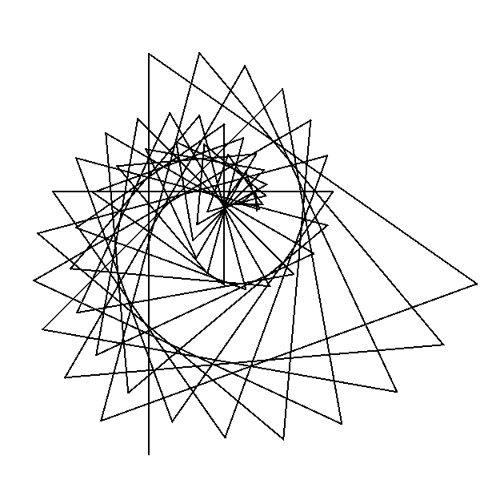
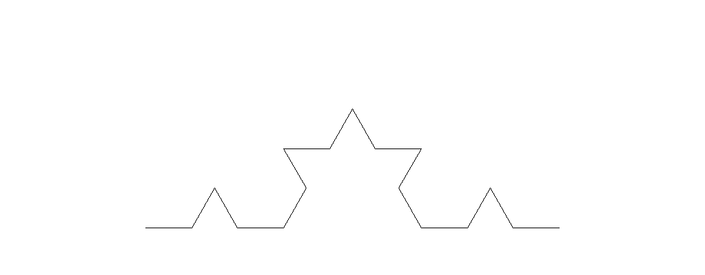
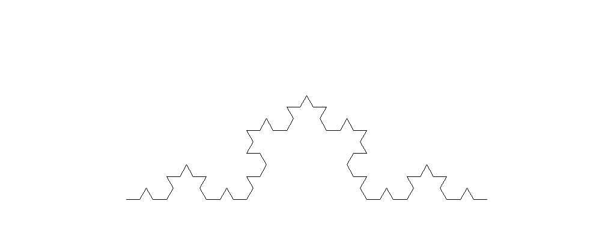
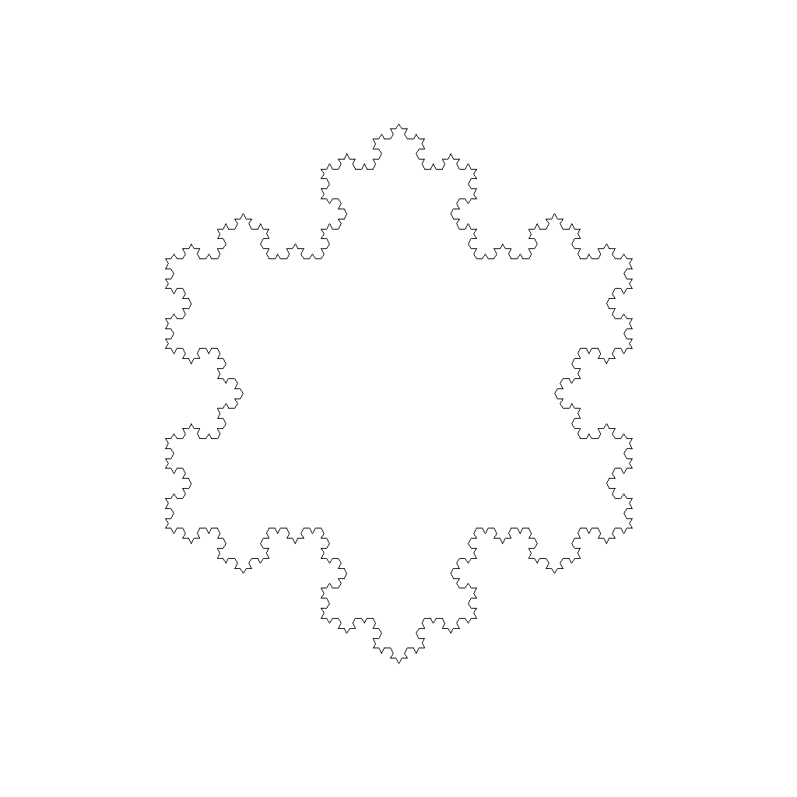
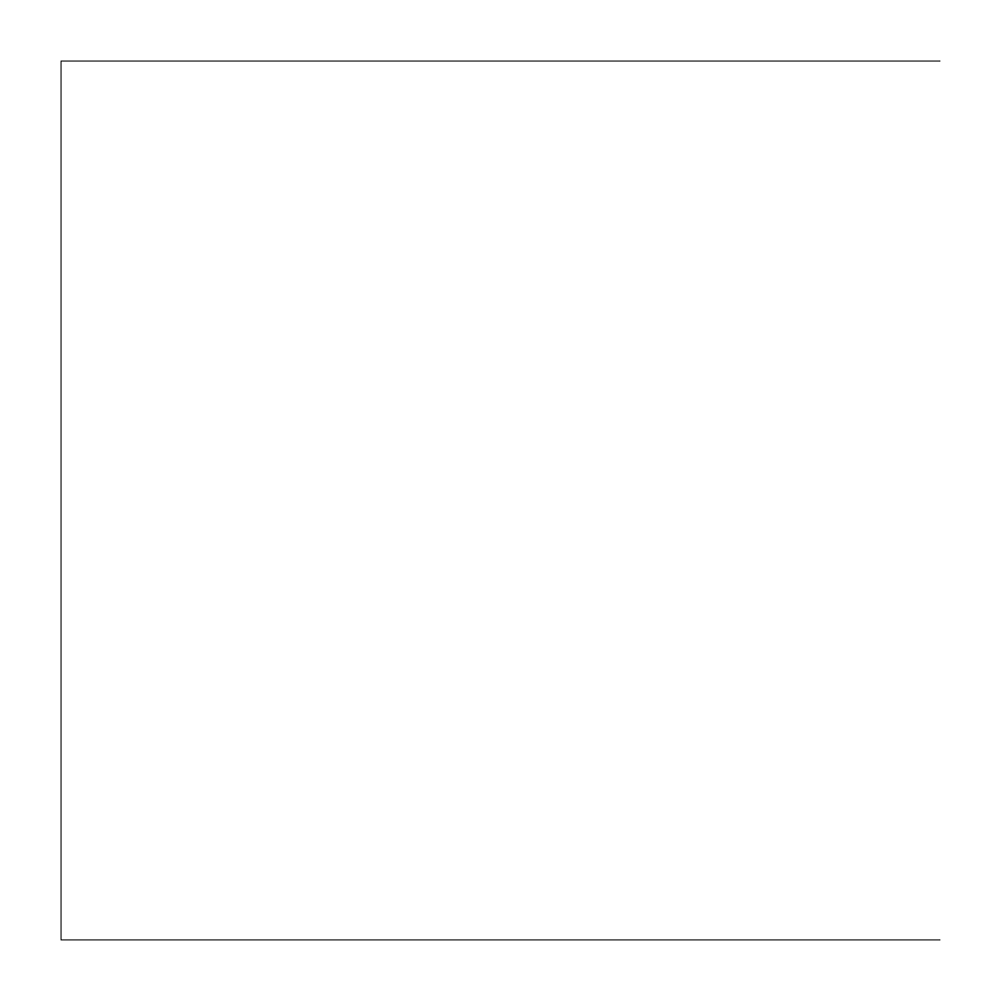
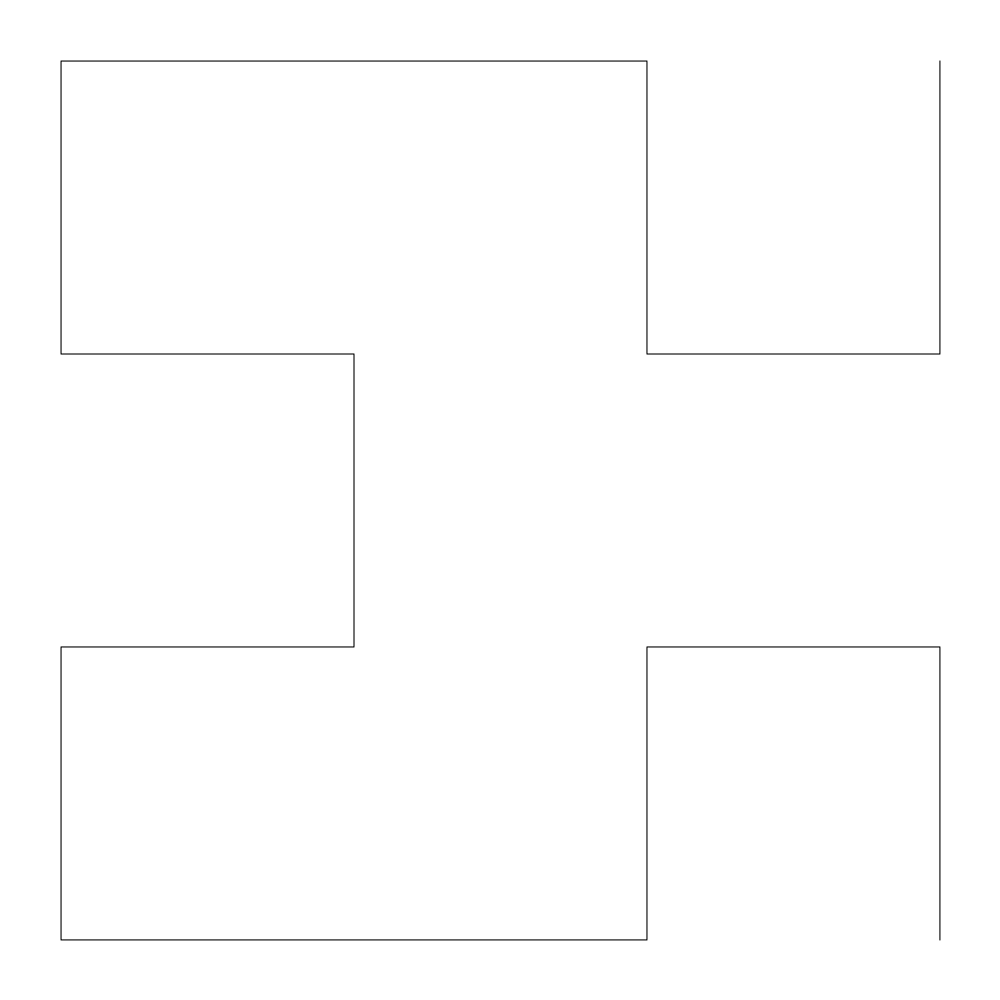
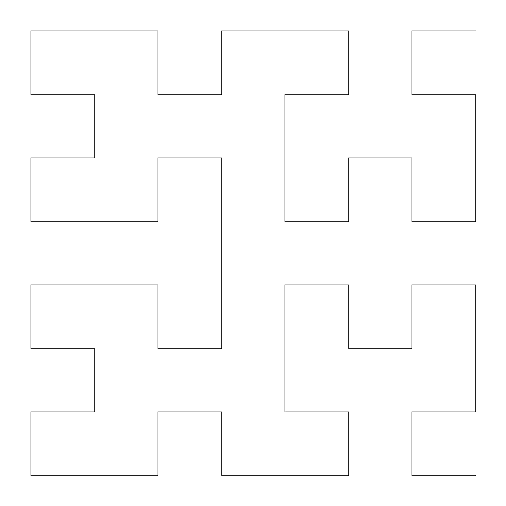
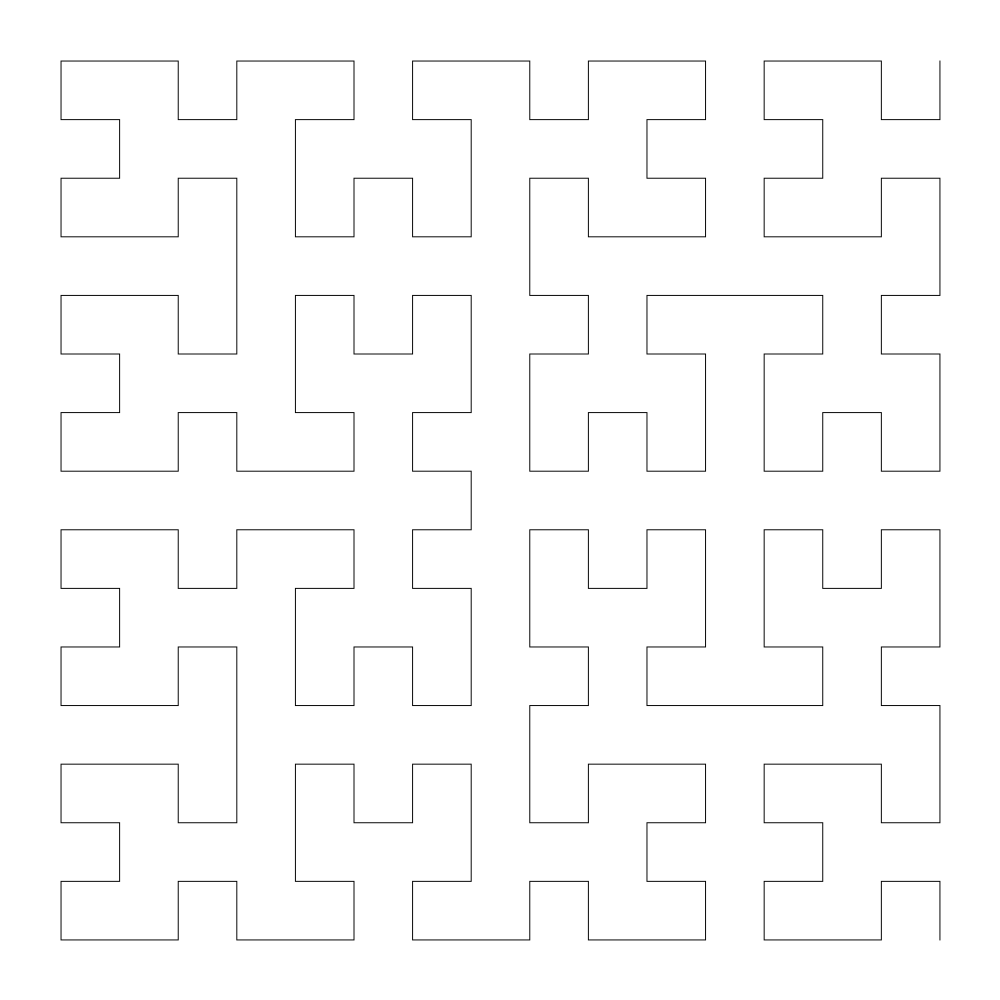


# Übungen 2

### Tutoren

[matthias.amberg@unibas.ch](mailto:matthias.amberg@unibas.ch)

### Foren-Austausch

Wir können uns für die Übungen auch mittels des offziellen [GymInf Moodle Forum](https://moodle.unifr.ch/mod/forum/view.php?id=673384) 
austauschen. 

### Übungs-Hilfsdateien

Bitte verwenden Sie die Vorlagen im [Zipfile zu den Übungen](https://github.com/unibas-marcelluethi/gyminf-programmieren/raw/master/docs/block2/uebung2.zip)

## Aufgabe 1 - Quersummen
Schreiben Sie ein Programm, welches eine Zahl einliest und deren Quersumme ausgibt.

Bei negativen Zahlen soll die Quersumme negativ sein.

Schreiben Sie Ihre Lösung in die bereits vorbereitete Datei _CrossSum.java_, die Sie im Verzeichnis _uebung2/src/main/java_ finden.

Das Programm sollte sich wie folgt verhalten: 

Wenn der Benutzer die Zeile

```
java CrossSum 17
```

auf der Konsole eingibt, soll das Programm die Zeile
```
8
```
ausgeben.

_Hinweise: Um Parameter welche Java übergeben werden Variablen vom Typ Integer zuzuweisen können Sie folgenden Code benützen:_
```java
int a = Integer.parseInt(args[0]);
```

Für die Lösung brauchen Sie die Ganzzahldivision '/' (nur bei Berechnungen mit Integer-Zahlen) sowie die modulo Operation '%'.

## Aufgabe 2 - Iterationsverfahren nach Newton
Die Kubikwurzel einer positiven reellen Zahl $a$ lässt sich näherungsweise durch die Iterationsformel bestimmen:

> $x_{n+1} = \frac{1}{3}(2 x_n + \frac{a}{x_n^2})$

Diese Formel wird wie folgt angewandt. Man wählt einen beliebigen Startwert $x_1$, und
berechnet mit der Formel den Wert $x_2$, indem $x_n = x_1$ und $x_{n+1} = x_2$ gewählt werden.

Das Ergebnis wird dann immer wieder (iterativ) in die Formel hineingesteckt. Die Formel ist so konstruiert, dass die Lösung immer dichter an der Kubikwurzel von $a$ liegt, als der Eingabewert.

Schreiben Sie ein Java-Programm _CubicRoot_, das die Kubikwurzel der Eingabe berechnet. Dabei gilt ein Iterationswert als gut genug, falls er von dem nachfolgendem Iterationswert nicht um mehr als $1e−8$ abweicht. 

Hinweise:
* Deklarieren Sie die Variablen als Typ _double_.
* Weisen Sie zur Verarbeitung der Eingabe $a$ den Wert 
```
Double.parseDouble(args[0])
``` 
zu.
* Starten Sie mit dem Iterationswert 1.
* Nutzen Sie zur Berechnung des Absolutbetrags einer Zahl _x_ die Funktion _Math.abs(x)_.

Schreiben Sie Ihre Lösung in die bereits vorbereitete Datei _CubicRoot.java_, die Sie
im Verzeichnis _uebung2/src/main/java_ finden.

Anmerkung für Interessierte: Die obige Formel ergibt sich aus dem Iterationsverfahren
nach Newton. Um die Nullstelle einer Funktion $f$ zu finden, nutzt man die allgemeine Iterationsvorschrift:

$$x_{n+1} = x_n - \frac{f(x_n)}{f'(x_n)}$$

In unserem Fall ist $f(x) = x^3 - a $.

## Aufgabe 3 - Turtlegrafik: Muster reproduzieren

Versuchen Sie folgende zwei Muster mit Turtlegrafik zu reproduzieren: Es ist dabei nicht wichtig, dass Sie genau dieselben Linienabstände oder Winkel wählen. Wichtig ist der allgemeine Aufbau des Musters.

{:height="50%" width="50%"}{:height="50%" width="50%"}

Das Programm sollte sich wie folgt verhalten: Wenn der Benutzer das Programm mit den
Argumenten _1 output.png_ aufruft, soll das Programm das erste Muster in die Datei
_output.png_ schreiben. Entsprechend sollen der Aufruf mit den Argumenten _2 output.png_ das zweite Muster produzieren.

Schreiben Sie Ihre Lösung in die bereits vorbereitete Datei TurtlePatterns.java,
die Sie im Verzeichnis _uebung2/src/main/java_ finden.
Dieses Programm nutzt wieder die Java Bibliothek (jturtle), die Sie beim kompilieren
explizit mitangeben müssen. Sie kompilieren die Datei analog zur Squares Aufgabe auf 
[Übungsblatt 1 ](../block1/uebungen1.md)

## Aufgabe 4 - Java Stil
Sie finden im Verzeichnis _src/main/java_ die Klasse _styleMess_.

Passen Sie die Klasse so an, dass wenn Sie _gradlew checkstyleStyleMess_ aufrufen,
keine Fehler mehr ausgegeben werden. Sie müssen dafür die Namen von Klassen, Methoden
und Variablen ändern, die Formatierung anpassen, Klammern einfügen, etc. Sie dürfen
keinen Code löschen (d.h. alle Konstrukte müssen im Code noch zu finden sein).

Hinweis 1: Checkstyle erzeugt einen Bericht im HTML Format, welcher einfacher zu lesen
ist. Sie finden die URL in der Ausgabe von Checkstyle.

Hinweis 2: Die Java Code-Konventionen sind auf der Seite von Oracle dokumentiert:
<https://www.oracle.com/technetwork/java/codeconvtoc-136057.html>

## Aufgabe 5 - Rekursion (Kochkurve)
Im Verzeichnis _src/main/java_ finden Sie die Klasse Snowflake.png Implementieren Sie eine Methode _drawKochCurve_. Diese Methode soll rekursiv (d.h. durch Aufrufe von sich selbst) folgende Kurven erzeugen:

Rekursionstiefe 1:
{:height="50%" width="50%"}

Rekursionstiefe 2:
{:height="50%" width="50%"}

Rekursionstiefe 3:
{:height="50%" width="50%"}

Die Rekursionstiefe wird durch das Konstruktorargument _depth_ bestimmt.
Die Distanz zwischen Start und Endpunkt der Kurve soll unabhängig von der Rekursionstiefe immer gleich sein und der Konstante _LENGTH_OF_CURVE_ entsprechen.
Nutzen Sie die Methode _setStartPosition_ um das Turtle **vor dem Aufruf der
rekursiven Methode** auf der Zeichenfläche zu positionieren.

Zum Kompilieren und Ausführen müssen Sie, wie öfters, die Turtle Bibliothek mit einbinden. Genauso wie bei Blatt 2: Aufgabe 5 - Rekursion.

Implementieren Sie dann die Methode _drawSnowflake_, welche durch mehrmaliges
Aufrufen von drawKochCurve eine Schneeflocke zeichnet.



## Aufgabe 6 - Hilbertwalk
Sie finden im Verzeichnis _src/main/java_ die Klasse _Hilbertwalk_. Implementieren
Sie die Methode _drawHilbert_, welche die Hilbertkurve zeichnet. Die Hilbertkurve ist
eine rekursiv definierte Kurve, die auf den ersten vier Rekursionstiefen wie folgt aussieht:

Rekursionstiefe 1:
{:height="33%" width="33%"}

Rekursionstiefe 2:
{:height="33%" width="33%"}

Rekursionstiefe 3:
{:height="33%" width="33%"}

Rekursionstiefe 4:
{:height="33%" width="33%"}

Um die Kurve zu zeichnen, müssen Sie zwei rekursive Methoden, _hilbertA_ und _hilbertB_ definieren, welche sich gegenseitig aufrufen. Die Regeln sind wie folgt. Sie starten mit einer Methode _hilbertA_, welche mittels Turtle folgendes Sequenz definiert:

Methode A : $− BF + AF A + F B −$

Das $+$ respetive $−$ bedeutet, dass sie 90 Grad nach rechts, respektive links drehen. Ein $F$
bedeutet, dass Sie das Turtle nach vorne bewegen müssen. Ein $B$ bedeutet, dass Sie die
Methode _hilbertB_ aufrufen. Die Methode _hilbertB_ wird nach dem ähnlichen Muster
definiert:

Methode B: $+ AF − BF B − F A+$

Ein $A$ bedeutet hier, dass Sie wiederum die Methode _hilbertA_ aufrufen müssen.

Beginnen Sie die Aufgabe, indem Sie jede Linie mit der fixen Länge zeichnen, die in dem Feld lengthLineSegment definiert ist. Die Zeichnung wird dadurch auf jeder Rekursionsebene grösser. Passen Sie in einem zweiten Schritt die Methode
_computeLengthOfLineSegment_ an, so dass die Seitenlänge jeder Zeichnung der Konstanten _BASE_LENGTH_ entspricht.
Tipp: Sie brauchen dafür die Methode _Math.pow(a, b)_ welche $a^b$
berechnet.

Wiederrum müssen Sie das jturtle-jar Archiv einbinden beim Kompilieren und Ausführen. Genauso wie bei Blatt 2: Aufgabe 5 - Rekursion.

## Automatisiertes Testen der Übungen 

Sie können diese Aufgaben wie schon besprochen manuell mit _javac_ und _java_ kompilieren und ausführen. Wir stellen Ihnen aber eine Test-Suite zur Verfügung, mit denen Sie Ihre Lösung bis zu einem gewissen grad selbständig überprüfen können. Falls Sie das automatisiert testen möchten, lesen Sie bitte die [Kurzanleitung](../block1/kurzanleitung-gradle.md)
