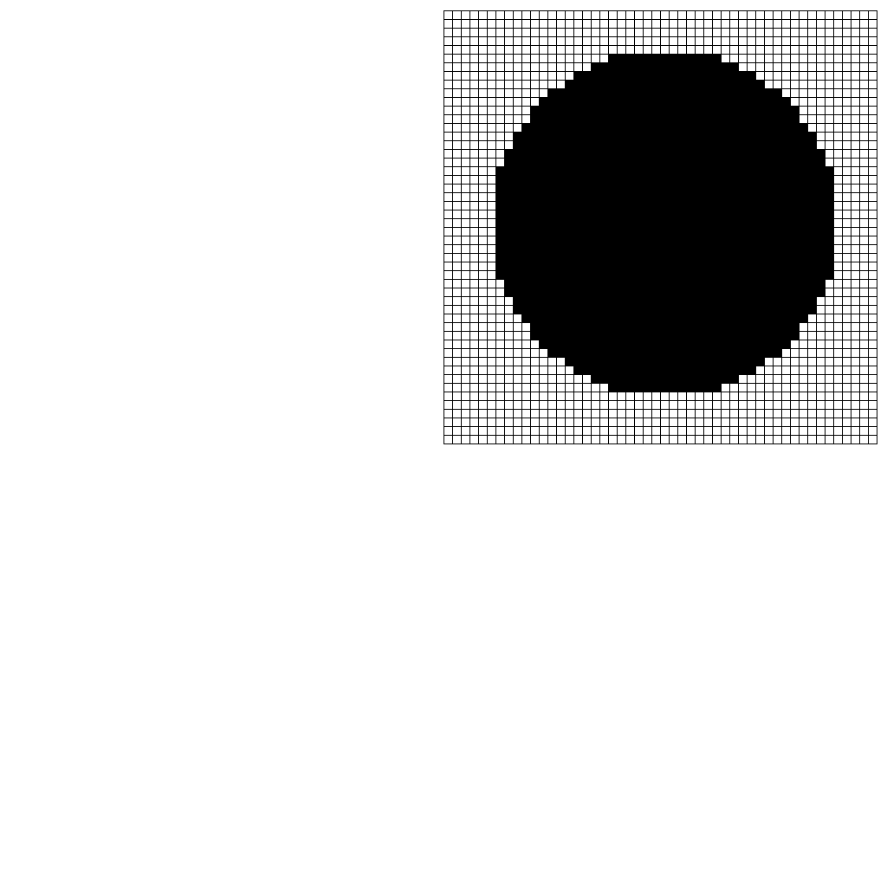


# Übungen 3

### Tutoren

[matthias.amberg@unibas.ch](mailto:matthias.amberg@unibas.ch)

### Foren-Austausch

Wir können uns für die Übungen auch mittels des offziellen [GymInf Moodle Forum](https://moodle.unifr.ch/mod/forum/view.php?id=673384) 
austauschen. 

### Übungs-Hilfsdateien

Bitte verwenden Sie die Vorlagen im [Zipfile zu den Übungen](https://github.com/unibas-marcelluethi/gyminf-programmieren/raw/master/docs/block3/uebung3.zip)

### Hinweise

* Wir empfehlen Ihnen, dass Sie im Buch "Sprechen Sie Java" bis und mit Kapitel 9 lesen.
* Wechseln Sie in den Ordner _src/main/java_. Dort finden Sie die Dateien, in welche Sie ihren Java Code schreiben.
* Schreiben Sie ihr Programm, kompilieren Sie dieses mit dem Java Compiler javac und führen Sie es mit java aus, wie es in der Vorlesung gezeigt wurde.
* Wenn Sie denken, dass alles in Ordnung ist, wechseln Sie zurück ins Übungsverzeichnis _uebung3_ und führen da _gradlew test_ aus um zu überprüfen ob Ihre Lösung die automatisierten Tests besteht. Überprüfen Sie auch Ihren Codestil mit _gradlew checkstyleMain_.

## Aufgabe 1 - Transponierte einer Matrix

Sie finden im Verzeichnis src/main/java/ die Datei Matrix.java. Implementieren
Sie die Methode transpose(double[][] matrix) die eine Matrix von beliebiger
Dimension nimmt und die Transponierte dieser Matrix zurückgibt. Die übergebene Matrix
darf dabei nicht verändert werden.

## Aufgabe 2 - Bubble Sort I

Mit dem Verfahren _Austauschsortieren_ (Bubble Sort) kann man die Elemente eines Arrays
sortieren. Dazu wandert man von vorne nach hinten durch das Array und betrachtet
jeweils benachbarte Elemente. Wenn diese in der falschen Reihenfolge stehen, vertauscht
man sie. Ist man am Ende des Arrays angelangt, beginnt man wieder von vorne - solange
bis keine Vertauschungen mehr auftreten.

Sie finden im Verzeichnis _src/main/java_ die Datei _BubbleSort.java_. Implementieren Sie die fehlenden Methoden in dieser Klasse.

## Aufgabe 3 - Pixelgrafik

Sie finden im Verzeichnis _src/main/java/_ die Datei _TurtlePixelGraphics.java_.
Darin sind die Methoden drawPixel und newLine implementiert, mit der Sie mit
Turtlegrafik einen Pixel an der aktuellen Turtleposition zeichnen können sowie jeweils auf
die nächste Zeile springen können.

Implementieren Sie eine Methode _drawImage(bool[][] image)_, welches ein 2D boolean Array nimmt, und daraus das resultierende Bild zeichnet, indem es obige Funktionen
aufruft.

Um die Methoden zu testen, implementieren Sie eine Methode _implicitCircle_ welche
die impliziten Gleichung für den Kreis

$x^2+y^2-r^2<0$

einen Kreis mit Radius _r_ implementiert.

Schlussendlich implementieren Sie die Methode _drawCircleImage_, welche ein Bild (ein
2D boolean Array) eines Kreises mit gegebenem Radius erstellt.

> Hinweis: Beachten Sie, dass obige Kreisgleichung einen Kreis mit Radius $r$ mit Mittelpunkt
$(0, 0)$ definiert. Sie können also nicht direkt die Indizes ihres Arrays für die Definition
nehmen, sondern müssen diese noch entsprechend anpassen, damit der Kreis in die Mitte
des Bildes zu liegen kommt.

Kompilieren und starten Sie das Programm mit der Angabe der Datei jturtle-0.5.jar, also so wie die Squares Aufgabe auf Blatt 1.

Es sollte folgendes Bild erstellt werden:



## Aufgabe 4 - Binär und Hexadezimaldarstellung
In dieser Aufgabe sollen Sie Zahlen von einer Basis in eine andere umschreiben. Dafür
müssen Sie die fehlenden Methoden in der Java Datei _NumberConversions.java_ implementieren, welche Sie im Verzeichnis _src/main/java_ finden.

### a) Umwandlung einer Dezimalzahl in eine Hexadezimalzahl

Unsere gewohnten Zahlen sind die Dezimalzahlen. Das sind Zahlen zur Basis zehn
mit den Ziffern 0 bis 9. Jede Stelle $i$ hat die Wertigkeit $10^{i−1}$. Die Hexadezimalzahlen sind Zahlen zur Basis 16. Sie bestehen aus den Ziern 0 bis 9 und den Buchstaben A, B, C, D, E und F für die Dezimalwerte 10, 11, 12, 13, 14 und 15. Jede Stelle $i$ hat
die Wertigkeit $16^{i−1}$. Um Hexadezimalzahlen von Dezimalzahlen zu unterscheiden, notieren wir sie mit dem Präfix '0x'.
Beispiel:

0x1B7 $= 1 · 16^2 + 11 · 16^1 + 7 · 16^0 = 256 + 176 + 7 = 439$

Implementieren Sie die Methode binToHex, welche eine positive ganzzahlige Dezimalzahl in eine Hexadezimalzahl umwandelt und diese als String zurückgibt. Verwenden sie keine von Java bereitgestellte Umwandlungsmethode. Ihr Programm sollte sich also wie folgt verhalten:

```
> java NumberConversion 439
0x1B7
```

### b) Umwandlung einer Binärzahl in eine Dezimalzahl
Implementieren Sie die Methode binToDec, welche eine positive ganzzahlige Binärzahl in eine Dezimalzahl umwandelt und diese Zurückgibt. Die Binärzahl wird als String mit dem Präfix 0b
übergeben.
Ihr Programm sollte sich also wie folgt verhalten

```
> java NumberConversion 0b1001
9
```

## Aufgabe 5 - Zeichenketten-Analyse
Sie finden im Verzeichnis _src/main/java_ die Datei _Palindrom.java_.
Implementieren Sie die Methode testPalindrom, welche den übergebenen Text daraufhin überprüft, ob er ein Palindrom ist.
Ein Palindrom ist ein Text, dessen Zeichen vorwärts und rückwärts gelesen die selbe Reihenfolge ergeben. **Beachten Sie dabei nur die Buchstaben, nicht die Leer- und Sonderzeichen** des eingegebenen Textes, und ignorieren Sie Gross- und Kleinschreibung. Ein
paar Beispiele für Palindrome sind:

* Reliefpfeiler
* Lagerregal
* egale Lage
* Trug Tim eine so helle Hose nie mit Gurt?
* Eine güldne, gute Tugend: Lüge nie!
* A nut for a jar of tuna.
* Borrow or rob?

## Aufgabe 6 - Kommentare Löschen

Sie finden im Verzeichnis _src/main/java_ die Datei _Comments.java_.
Implementieren Sie die fehlende Funktion removeComments, welche für ein übergebenes
Java Programm alle Kommentarzeilen die mit /\* \*/ oder // markiert sind, entfernt.
Das der Methode übergebene Argument darf dabei nicht verändert werden.
Beachten Sie: Verschachtelte Klammerkommentare (also /\* /\* \*/ \*/) sind in Java
Programmen nicht möglich. Ein Klammerkommentar kann aber in einem Zeilenkommentar vorkommen.


## Automatisiertes Testen der Übungen 

Sie können diese Aufgaben wie schon besprochen manuell mit _javac_ und _java_ kompilieren und ausführen. Wir stellen Ihnen aber eine Test-Suite zur Verfügung, mit denen Sie Ihre Lösung bis zu einem gewissen grad selbständig überprüfen können. Falls Sie das automatisiert testen möchten, lesen Sie bitte die [Kurzanleitung](../block1/kurzanleitung-gradle.md)
