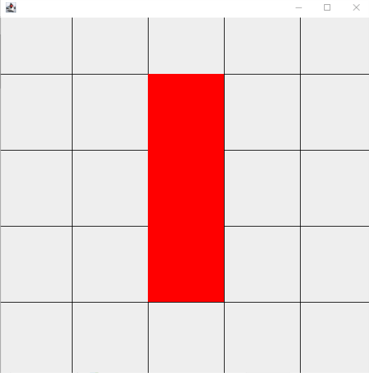
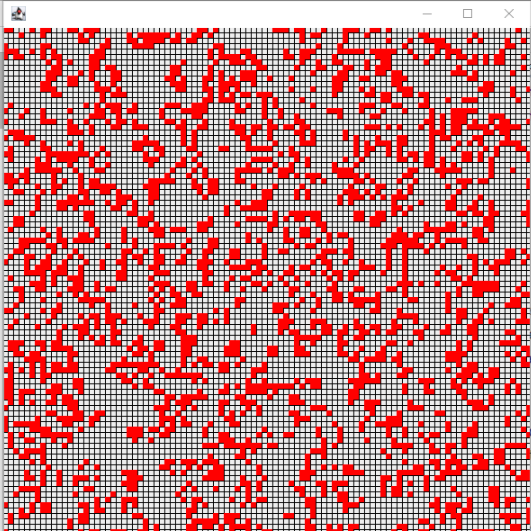


# Übungen 5

### Tutoren

[matthias.amberg@unibas.ch](mailto:matthias.amberg@unibas.ch)

### Foren-Austausch

Wir können uns für die Übungen auch mittels des offziellen [GymInf Moodle Forum](https://moodle.unifr.ch/mod/forum/view.php?id=673384) 
austauschen. 

### Übungs-Hilfsdateien

Bitte verwenden Sie die Vorlagen im [Zipfile zu den Übungen](https://github.com/unibas-marcelluethi/gyminf-programmieren/raw/master/docs/block5/uebung5.zip)

### Musterlösungen

Musterlösungen finde sie wie gewohnt auf der [Moodle Seite des Kurses](https://moodle.unifr.ch/mod/folder/view.php?id=688193).

### Allgemeine Hinweise

* Wechseln Sie in den Ordner _src/main/java_. Dort finden Sie die Dateien, in welche Sie ihren Java Code schreiben.
* Schreiben Sie ihr Programm, kompilieren Sie dieses mit dem Java Compiler javac und führen Sie es mit java aus, wie es in der Vorlesung gezeigt wurde.
* Für die Game Of Life Übungen gibt es keine Testklassen, aber Sie können selber das Resultat visuell überprüfen.

## Übung 1 - Game Of Life
Das Spiel des Lebens (Game of Life) geht auf den Mathematiker John Conway zurück
und funktioniert nach folgenden Prinzipien:
[http://www.math.com/students/wonders/life/life.html](http://www.math.com/students/wonders/life/life.html)

Die Grundeinheit sind Zellen, die in einer Matrix angeordnet sind. Jede Zelle kann lebendig
oder tot sein. Jede Zelle hat acht Nachbarn, wobei Randzellen die Zellen des gegenüberliegenden Randes als Nachbarn haben. Der Zustand der Zellen (lebendig oder tot) ändert sich von Generation zu Generation. Die aktuelle Zellpopulation beeinflusst die darauffolgende Generation nach folgenden Regeln:

1. Eine tote Zelle mit genau drei lebenden Nachbarn erwacht zum Leben (birth).
1. Eine lebende Zelle mit zwei oder drei lebenden Nachbarn bleibt am Leben (survival).
1. Alle anderen lebenden Zellen sterben (overcrowding or loneliness).

Sie finden im Verzeichnis
 src/main/java/ die Klasse GameOfLife, welche als
Feld eine Zellenpopulation als eine size × size Matrix vom Typ boolean speichert.
Jedes Element hat entweder den Wert false (tote Zelle, '.') oder true (lebende Zelle,
'@'). Speichern Sie auch die Grösse size als Feld der Klasse.

### Konstruktoren

Implementieren Sie den Konstruktor, welcher ein boolean Array mit einem gegebenen
Muster (repräsentiert als zweidimensionales boolean Array) entgegennimmt und die ent-
sprechenden Felder setzt.
Danach implementieren Sie die statischen Methoden
 _createBlock_, _createBlinker_ und _createGlider_,
 welche ein neues Game of Life mit folgenden Mustern initialisiert:

#### Block
    ....
    .@@.
    .@@.
    ....

#### Blinker
    .....
    ..@..
    ..@..
    ..@..
    .....

#### Glider
    ......
    .@.@..
    ..@@..
    ..@...
    ......
    ......

Implementieren Sie ausserdem eine statische Methode _createRandom_,
 welche ein Objekt der Klasse _GameOfLife_ für eine angegebene Feldgrösse erstellt. Der Wert jeder Zelle soll dabei zufällig gesetzt werden. Dabei wird jede Zelle mit der angegebenen Wahrscheinlichkeit als "lebend" initialisiert. Verwenden Sie dazu die Klasse
 _java.util.Random_.

### Evolution
Implementieren Sie die Methode _isActive_, die den Wert aus dem Feld abfragt, eine
Methode _getNumberOfActiveNeighbors_, welche die lebenden Nachbarn zählt und
eine Methode _update_, welche das Update ausführt. Dabei soll der Zustand aller Zellen
zur "gleichen" Zeit ausgeführt werden. Verwenden Sie dazu eine Kopie der Zellpopulation.
Beachten Sie ferner, dass der Zugriff auf eine Zelle jeweils auf der gegenüberliegenden Seite geschieht wenn auf die Nachbarn von Zellen am Rand zugegriffen wird.

### Ausgabe
Schreiben Sie nun noch die Methode _public String toString()_, welche die Population in einem String darstellt. Um Zeilenumbrüche in einem
 String darzustellen, können Sie die Zeichenfolge "\n" verwenden. Jede Zelle soll dabei durch ein . oder ein @ dargestellt werden.

### Testprogramm

Implementieren Sie die Methoden im Testprogramm
 _GameOfLifeCommandLine_, welches die Evolutionsschritte vom GameOfLife berechnet und das Ergebnis jeweils auf der Konsole ausgibt.

## Übung 2 - Game of Life - AWT

> :warning:  Falls Sie die vorige Aufgabe nicht lösen konnten, können Sie Klasse _MockGameOfLife_
nutzen, die Sie im Verzeichis _src/main/java/_ finden.

Sie finden im Verzeichnis _src/main/java/_ die Java-Klasse _GOLWindow_ zur Visualisierung des Game Of Life. Implementieren Sie die fehlenden Methoden in dieser Klasse, gemäss den angegebenen Spezifikationen in den Kommentaren.

Experimentieren Sie mit verschiedenen Konfigurationen. Für die Konfiguration Blinker (und das MockGameOfLife) sollte ihre Ausgabe im ersten Schritt etwa so wie das folgende Bild aussehen:

Wenn Sie grosse, zufällige Welten simulieren, sieht die Ausgabe etwa wie
in diesem Bild aus:

## Übung 3 - Game of Life - AWT mit Double Buffering
Wenn Sie die vorige Übung gelöst haben, ist ihnen vielleicht aufgefallen, dass bei grossen Welten die Darstellung ins Stocken gerät. Abhilfe schafft hier das Double buffering. Double buffering ist eine Strategie, bei welcher nicht direkt auf den Screen gezeichnet wird, sondern erst ein Bild gezeichnet wird, welches dann in der Paint Methode jeweils direkt dargestellt wird. Die Klasse _JFrame_ (respektive deren Superklasse _Component_) stellt dafür bereits die Methode
 _createImage_ zur Verfügung, welches ein Offscreen Image
erstellt, in welches gezeichnet werden kann.

Schreiben Sie ihr Programm nun so um, dass es double buffering benutzt. Dazu kopieren Sie ihre Lösungen zur vorigen Aufgabe erst in die Klasse
 _GOLWindowDoubleBuffering_ und passen diese dann entsprechend an. Erstellen Sie dazu ein Feld _offscreenImage_
sowie ein Feld _offscreenGraphics_. Das Feld
 _offscreenGraphics_ ist vom Datentyp
 _java.awt.Graphics_. Beim ersten Aufruf der Paint-Methode soll nun mittels
_createImage_ das _offscreenImage_ gesetzt werden und mit dem Befehl
_offscreenImage.getGraphics()_ das Feld _offscreenGraphics_. Wenn diese Felder gesetzt sind, zeichnen Sie nun in dieses Bild und nutzen dann die Methode _drawImage_,
um das offscreen gerenderte Bild darzustellen (Achtung: stellen Sie sicher, dass Sie das richtige Graphics-Objekt nutzen. )

> :warning:   Sie dürfen bei dieser Teilaufgabe auch im Internet recherchieren, um Codebeispiele zu finden.
