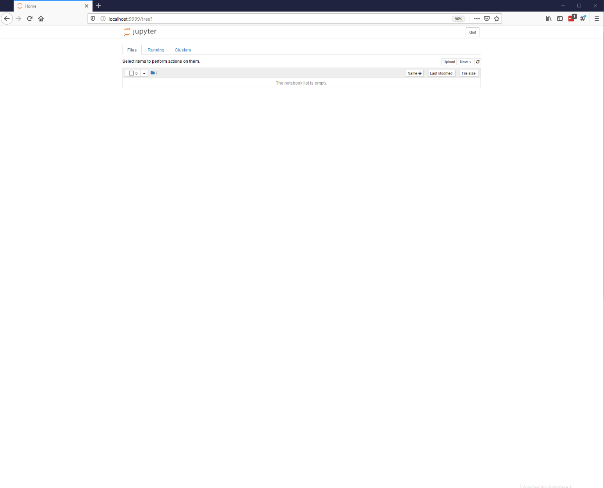
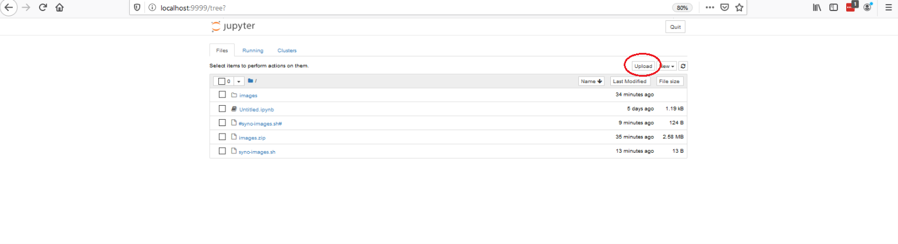

# Lokale Installation von Jupyter-Notebooks mit Java-Kernel

Jupyter-Notebooks sind eine Webanwendung, die es ermöglicht Programme in einem Webbrowser zu schreiben, zu kommentieren und auszuführen. 
 Jupyter Notebooks wurden ursprünglich für Python geschrieben, sind aber inzwischen auch für andere Programmiersprachen verfügbar. Seit kurzen besteht auch die Möglichkeit, Jupyter Notebooks mit Java zur nutzen.  Da das dafür benötigte [ijava](https://github.com/SpencerPark/IJava) Programm noch nicht im Standardumfang von Jupyter Notebooks enthalten ist, ist die Installation noch etwas aufwändig. 
 
 Falls Sie Jupyter-Notebooks (mit Java Unterstützung) gerne auf Ihrem eigenen Computer installieren möchten,haben Sie zwei Möglichkeiten. Die erste nutzt [Docker](https://www.docker.com/). Hier ist die grösste Hürde die Installation von Docker selbst. Alle anderen Schritte übernimmt dann unser Docker Container für Sie. Bei der zweiten Variante installieren Sie zuerst Jupyter Notebooks und danach manuell den IJava kernel. 

 Sie brauchen aber nicht zwingend eine eigene Installation von Jupyter-Notebooks. Sie können auch weiterhin einfach mit der [Online-Version](https://nbviewer.jupyter.org/github/unibas-marcelluethi/gyminf-programmieren/tree/master/notebooks/) arbeiten. 

## Installation mit Docker (Empfohlen)

Damit Sie den unseren Docker Container nutzen können, müssen Sie zuerst Docker oder Docker toolbox auf Ihrem System installieren. Docker toolbox wählen Sie immer dann, wenn Sie auf einer Windows version arbeiten, die Docker nicht unterstützt (Wie zum Beispiel Windows 10 home) oder Sie bereits Virtualbox unter Windows einsetzen. 

1. Folgend Sie dann der Installationsanleitung für Ihr System:
    * Anleitung für [Windows (Docker)](https://docs.docker.com/docker-for-windows/install/)
    * Anleitung für [Windows (Docker toolbox)](https://docs.docker.com/toolbox/toolbox_install_windows/)
    * Anleitung für [MacOS](https://docs.docker.com/docker-for-mac/install/)
    * Anleitung für Linux: [Ubuntu](https://docs.docker.com/install/linux/docker-ce/ubuntu/), [Debian](https://docs.docker.com/install/linux/docker-ce/debian/), [Fedora](https://docs.docker.com/install/linux/docker-ce/fedora/), [CentOS](https://docs.docker.com/install/linux/docker-ce/centos/)


2. Öffnen Sie eine Kommandozeile (Terminal). Sie sollten in dieser Kommandozeile Administrationsrechte haben.
    * Unter Windows können Sie die Kommandozeile als Administrator öffnen indem Sie im Startmenu auf den Kommandozeileneintrag Rechtsklicken und "als Administrator ausführen" auswählen.
    * Unter Linux und Mac können Sie die Kommandozeile als normaler Nutzer ausführen und dann ```sudo su ``` aufrufen um Administrator zu werden.

Geben Sie nun folgenden Befehl ein um den Container mit dem Jupyter Notebook auf ihr System zu bringen.
```
 docker pull  marcelluethi/jupyter-ijava:1.3
```

*Falls Sie in diesem Schritt eine Fehlermeldung bekommen, könnte es daran liegen, dass Docker nicht gestartet ist. Unter Windows und MacOS starten Sie Docker, in dem Sie die Docker Anwendung aufrufen (Sie finden diese im Startmenu). Unter Linux sollte dieses Problem nicht auftauchen.*

Nun kreieren Sie den Docker Container mit dem folgenden Befehl:
```
docker create --name jupyter-java -p 9999:8888  -it marcelluethi/jupyter-ijava:1.3
```
Dies erzeugt einen neuen Docker-Container mit dem Namen ```jupyter-java```. 

Um Ihre Notebook-Umgebugn zu starten geben Sie folgenden Befehl ein:
```
docker start jupyter-java
```

Falls Sie diesen Schritt erfolgreich durchgeführt haben, steht Ihnen nun die Jupyter Notebooks Umgebung auf Ihrem Computer zur Verfügung. 

Starten Sie nun einen Browser und falls Sie Docker (und nicht Docker toolbox verwenden) geben Sie folgende URL ein 
```
http://localhost:9999
```
Falls Sie Docker toolbox verwenden, geben Sie folgende URL ein
```
http://192.168.99.100:9999
```

Falls Sie folgende Webseite sehen, war die Installation erfolgreich.
 


#### Starten des Docker containers nach einem Neustart des Systems

Wenn Sie den Computer neu starten oder im Jupiter Notebook auf den *Quit* Knopf drücken, wird der Docker container gestoppt. Um diesen wieder zu starten, geben Sie folgendes Kommando ein

```
docker start jupyter-java
```

## Manuelle Installation ohne Docker (Fortgeschrittene Benutzer)

*Wir empfehlen diese Version nur, wenn Sie Docker nicht installieren wollen oder können, oder wenn Sie bereits Erfahrung mit Python oder Jupyter-Notebooks haben.* 

Die manuelle Installation besteht aus 2 Schritten. 

1. Als erstes müssen Sie Jupyter-Notebooks installieren. 
Folgen Sie dafür folgender [Anleitung](https://jupyter.readthedocs.io/en/latest/install.html).
2. Danach müssen Sie noch den Java Kernel installieren. Die benötigten Schritte sind [hier](https://github.com/SpencerPark/IJava#installing) beschrieben. 
3. Falls Sie die Notebooks als Präsentationen darstellen können möchten, benötigen Sie zusätzlich die RISE extension. 
Installieren Sie diese gemäss [dieser Anleitung](https://rise.readthedocs.io/en/maint-5.6/installation.html).


Wenn Sie Jupyter-Notebooks starten, sollten Sie beim Erstellen eines neuen Notebooks nun den Java-Kernel auswählen können. 

## Kopieren der Notebooks und Bilder

Nach dem Starten von Jupyter-Notebooks können Sie die Notebooks die wir für die Vorlesung vorbereitet haben in Ihre Jupyter-Umgebung kopieren. 
Laden Sie dafür die entsprechenden Notebooks von [hier](https://nbviewer.jupyter.org/github/unibas-marcelluethi/gyminf-programmieren/tree/master/notebooks/) herunter und uploaden Sie 
diese in Ihre Juyter Umgebung indem Sie den Upload Button drücken (Siehe Bild).


Einige der Notebooks enthalten Bilder. Sie können diese [hier](https://drive.switch.ch/index.php/s/er6wJVVqT5U6yYf/download) als Zip-File herunterladen. Laden Sie das gesamte Zip File 
in Ihre Notebook Umgebung. Um das Zip-File zu entpacken öffnen Sie in der Jupyter-Umgebung ein Terminal (siehe Bild unten) und führen dann den Befehl
```
unzip -n images.zip
``` 
aus. 


